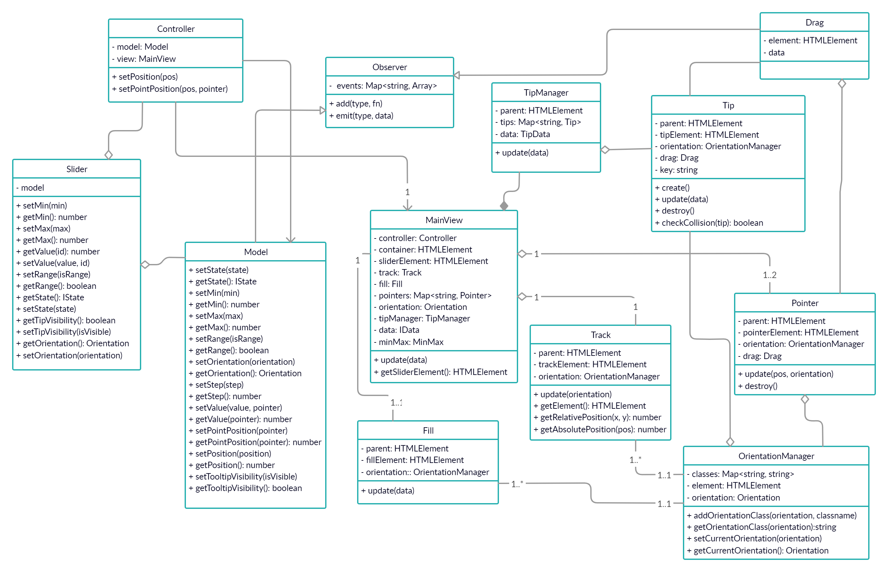

## **Слайдер**

Demos: [смотреть](https://vovnet.github.io/slider/)

JQuery плагин слайдер.

### *Содержание*
- [**Слайдер**](#слайдер)
  - [*Содержание*](#содержание)
  - [Установка](#установка)
  - [Использование](#использование)
    - [События](#события)
  - [Тесты](#тесты)
  - [Диаграмма](#диаграмма)

### Установка
Установка проекта:
```bash
git clone git@github.com:vovnet/slider.git
npm install
```
Запуск локального сервера:
```dotnetcli
npm run serv
```
Сборка проекта:
```bash
npm run build
```
Деплой на github pages:
```bash
npm run deploy
```

### Использование
Создаем слайдер:
```javascript
$('#slider').slider();
```
Конструктор слайдера принимает следующие параметры:
- минимальное и максимальное значения
- размер шага
- текущее значение (либо массив значений в случае установки `range: true`)
- одиночный или интервал
- горизонтальный или вертикальный вид
- отображать значения над бегунками
- обработчик события изменения значений слайдера

Эти значения можно задать либо через функцию `slider`, либо через объект возвращаемый этой функцией:
```javascript
const slider = $('#slider').slider({
    min: 0,
    max: 100,
    range: false,
    value: 50,
    step: 1,
    orientation: 'horizontal',
    showLabels: true
});

slider.minMax = [0, 10];
slider.step = 2;
slider.value = 5;
slider.values = [1, 10]; // в случае, если range: true
slider.orientation = 'vertical';
slider.labels = false;
```

#### События
Можно подписаться на 'change' событие слайдера:

```javascript
const slider = $('#slider').slider('add', 'change', () => {
    console.log(slider.value);
});
```

Так же, при создании слайдера можно передать в объекте настроек:

```javascript
$('#slider').slider({
    min: 0,
    max: 100,
    onChange: () => { console.log('data is changed') },
});
```

### Тесты
Тесты запускаются командой `npm test`
Покрытие `npm run coverage`

### Диаграмма

